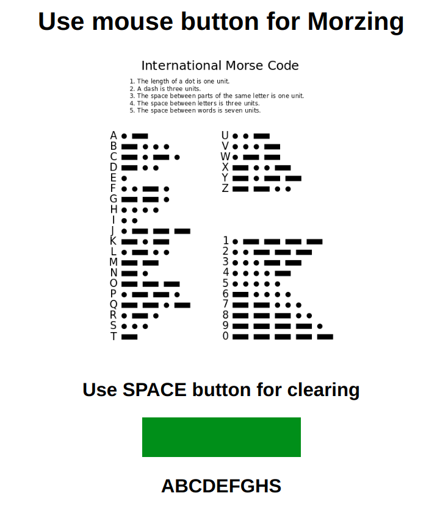

# Converting Morse code from mouse button using reactive programming
This app converts morse signals from mouse button to letters.

The app is based on:
- [KefirJS](https://kefirjs.github.io/kefir/) 
- [ReactJS](https://reactjs.org) 
  
To use it:
 - clone the repo and go to repo folder
 - execute commands:
 
`$ npm install`

`$ npm start`

Application will appear on http://localhost:3000 and will have the next view.

